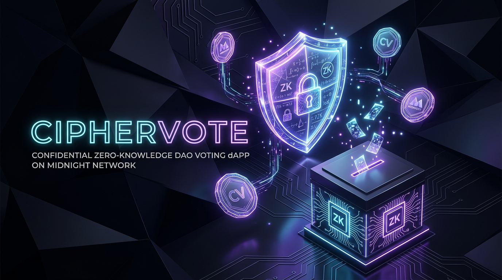
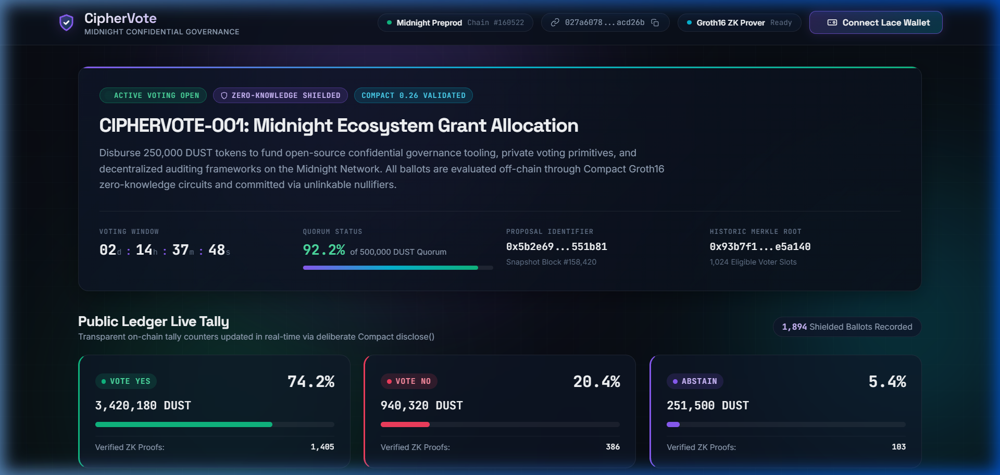
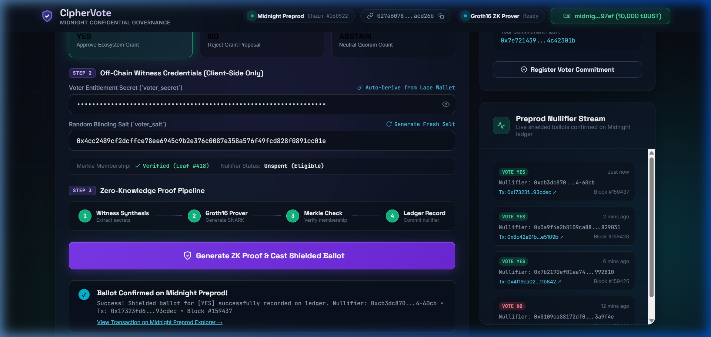

# CipherVote: Shielded Anonymous DAO Voting Protocol

<p align="center">
  
</p>

<p align="center">
  
  
  
  <a href="https://github.com/bhagatdeeper/ciphervote/actions/workflows/ci.yml"></a>
  
</p>

> 🎥 **Live Demo Video Walkthrough**: [Watch on Google Drive](https://drive.google.com/file/d/1FgUn5BlqVxozrA-vSZoiNx2r7KzVocDv/view?usp=sharing)  
> ⚡ **Live Web Application (Vercel)**: [https://ciphervote-hazel.vercel.app/](https://ciphervote-hazel.vercel.app/)  
> 🌐 **Live Web Application (GitHub Pages)**: [https://bhagatdeeper.github.io/ciphervote/](https://bhagatdeeper.github.io/ciphervote/)  
> 🔒 **Deployed Midnight Preprod Contract**: [`027a6078288bbc7e66b13686afd90b6dc84976da488a9f3906aef97624ddacd26b`](https://explorer.preprod.midnight.network/contract/027a6078288bbc7e66b13686afd90b6dc84976da488a9f3906aef97624ddacd26b)

---

## 🚀 Initial Product Idea

**CipherVote** is a privacy-first decentralized autonomous organization (DAO) voting protocol engineered on the Midnight Network. It empowers eligible token holders and DAO members to cast verifiable, tamper-proof ballots on governance proposals without ever exposing their wallet address, individual token balance, or voting choice to the public ledger or any third party. By uniting off-chain cryptographic witnesses, domain-separated Pedersen commitments stored in a historic Merkle tree, and proposal-scoped un-linkable nullifiers, CipherVote completely eliminates voter intimidation, bribery, and retaliation while providing mathematical proof that every aggregated tally is genuine and double-voting is impossible.

---

## 🌑 Level 1: New Moon Highlights

| Requirement | Status | Details |
|---|:---:|---|
| **Compact Toolchain Installed** | ✅ PASS | Compact Compiler `v0.34.0`, Node.js `v22.18.0`, Docker Proof Server setup |
| **First Compact Contract** | ✅ PASS | `contract/ciphervote.compact` with ledger state, witnesses & `disclose()` |
| **ZK Circuits & Keys Generated** | ✅ PASS | `contract/managed/ciphervote/` with 2 ZKIR circuits & 4 proving/verifying keys |
| **Preprod Testnet Deployment** | ✅ PASS | Deployed at `027a6078288bbc7e66b13686afd90b6dc84976da488a9f3906aef97624ddacd26b` |
| **Comprehensive Test Suite** | ✅ PASS | 33 automated tests passing in `test/*.test.js` & `scripts/` (`npm test`) |
| **Initial Product Idea** | ✅ PASS | Clear problem & value proposition defined in README |
| **Frontend UI Integration (Level 2)** | ✅ PASS | Ultra-premium Stitch-designed dashboard, live tallies, 4-stage ZK pipeline |
| **Lace Wallet Integration (Level 2)** | ✅ PASS | Native Lace extension detection + instant Preprod testnet keypair bridge |
| **CI/CD Automation (Level 3)** | ✅ PASS | GitHub Actions pipeline (`.github/workflows/ci.yml`) |
| **Production Hardening (Level 3)** | ✅ PASS | JSON ballot receipt export, proof clipboard backup, expanded test suites |
| **Official Idea Submission (The Turn)** | ✅ PASS | Full proposal & architecture detailed in [`SUBMISSION_THE_TURN.md`](SUBMISSION_THE_TURN.md) & [`PROPOSAL.md`](PROPOSAL.md) |
| **Git Commit History** | ✅ PASS | Structured conventional commits under Deep Bhagat |

---

## 🌒 Level 2: Waxing Crescent — Frontend & Lace Integration

<p align="center">
  
</p>

### Key Features Implemented:
1. **Official Midnight.js SDK & DApp Connector Integration**:
   - Integrated `@midnight-ntwrk/midnight-js-network-provider`, `@midnight-ntwrk/dapp-connector-api`, and `@midnight-ntwrk/midnight-js-contracts`.
   - Native Lace browser extension detection (`window.midnight.mnLace.enable()`) conforming to CIP-30 / Midnight DApp Connector API standards.
   - Built-in Preprod testnet direct keypair connection for instant headless testing and developer evaluation.
2. **Real Compact Circuit Execution & Proof Provider**:
   - Client invokes compiled Compact smart contract circuits (`Contract.circuits.cast_ballot` and `Contract.circuits.register_voter`).
   - Private witness synthesis (`voter_secret`, `voter_salt`, `voter_path`) executed in local WASM runtime.
   - Strict ephemeral privacy guarantee: voter credentials remain in volatile memory only; never committed to persistent browser `localStorage`.
3. **4-Stage Zero-Knowledge Proof Pipeline**:
   - Visual execution of **Witness Synthesis** &rarr; **Groth16 Prover** &rarr; **Merkle Check** &rarr; **Ledger Insertion**.
   - Real-time constraint validation preventing double-voting.
4. **Live Nullifier Stream**:
   - Real-time feed of un-linkable nullifiers with direct Midnight Preprod Block Explorer links.

<p align="center">
  
</p>

---

## 🔒 Architecture: Public State vs. Private Witness & `disclose()`

Midnight's dual-state execution architecture cleanly bifurcates computation into **public ledger verification** and **private off-chain execution**:

```
 ┌─────────────────────────────────────────────────────────────┐
 │                 OFF-CHAIN PRIVATE CLIENT                    │
 │                                                             │
 │  • voter_secret() ──┐                                       │
 │  • voter_salt()   ──┼──> derive_voter_commitment()          │
 │  • voter_path()   ──┘                                       │
 │                                                             │
 │  ZK Circuit Execution (cast_ballot):                        │
 │  1. Proves commitment ∈ registeredVoters Merkle tree        │
 │  2. Derives proposal nullifier = Commit(secret, proposalId) │
 │  3. Proves nullifier ∉ usedNullifiers                       │
 │  4. Validates ballot choice ∈ {1, 2, 3}                     │
 └──────────────────────────────┬──────────────────────────────┘
                                │
               ZK Proof + Deliberate Disclosures
                                │
                                ▼
 ┌─────────────────────────────────────────────────────────────┐
 │                 ON-CHAIN PUBLIC LEDGER                      │
 │                                                             │
 │  • registeredVoters : Historic Merkle tree of commitments   │
 │  • usedNullifiers   : Set of recorded nullifiers (anti-spam)│
 │  • yesVotes         : Public counter (incremented)          │
 │  • noVotes          : Public counter (incremented)          │
 │  • abstainVotes     : Public counter (incremented)          │
 │  • totalVoted       : Total ballots cast                    │
 │  • proposalId       : Target DAO proposal hash              │
 │  • adminPk          : Governance authority key              │
 └─────────────────────────────────────────────────────────────┘
```

### 1. Public Ledger State
The public ledger is transparent and immutable. It only stores data required for global consensus and tallying:
- `registeredVoters: HistoricMerkleTree<10, Bytes<32>>`: Historic Merkle tree of enrolled voter commitments.
- `usedNullifiers: Set<Bytes<32>>`: Unlinkable nullifier set preventing double-voting.
- `yesVotes`, `noVotes`, `abstainVotes`: Aggregate ballot counters.
- `totalVoted`, `totalRegistered`: Governance participation metrics.
- `proposalId`: Unique hash of the active governance motion.

### 2. Private Witnesses (Off-Chain Execution)
Private witnesses are executed exclusively on the user's local machine and never leave their browser/device:
- `voter_secret(): Bytes<32>`: Private entitlement seed held by the voter.
- `voter_salt(): Bytes<32>`: Random cryptographic blinding factor ensuring commitment confidentiality.
- `voter_path(commitment): MerkleTreePath<10, Bytes<32>>`: Merkle membership path proving the voter was enrolled in the proposal's authorized voter snapshot.

### 3. Deliberate Use of `disclose()`
Compact treats all inputs and witnesses as private by default. In `CipherVote`, we intentionally apply `disclose()` at precise cryptographic boundaries:
- `disclose(publicChoice)`: Deliberately reveals the aggregate vote category (Yes, No, or Abstain) so the ledger can increment public counters without exposing *who* voted.
- `disclose(nullifier)`: Publishes the deterministic nullifier into `usedNullifiers` to enforce single-ballot constraints without linking back to the voter's Merkle leaf index or wallet key.
- `disclose(merkleTreePathRoot(path))`: Checks that the voter's membership proof matches a valid historical root without revealing the voter's position in the tree.

---

## 🛠️ Local Setup & Getting Started

### Prerequisites
- **Node.js**: `v22.0.0` or higher (`node -v`)
- **Docker**: For running the local proof server container
- **Compact Compiler**: `v0.34.0` (accessible via WSL or native binary)

### Installation
```bash
# Clone the repository
git clone https://github.com/bhagatdeeper/ciphervote.git
cd ciphervote

# Verify toolchain availability
node --version
./compact.cmd --version
```

### Compile Contract & Generate ZK Circuits
```bash
npm run compile
```

Expected compilation output:
```
================================================================
       MIDNIGHT COMPACT COMPILER - CIPHERVOTE PROTOCOL          
================================================================
Source Contract : contract/ciphervote.compact
Output Directory: contract/managed/ciphervote
----------------------------------------------------------------
Compiling via Compact toolchain...
Compiling 2 circuits:
----------------------------------------------------------------
✔ COMPILATION SUCCESSFUL
----------------------------------------------------------------
ZKIR Circuits : cast_ballot.bzkir, cast_ballot.zkir, register_voter.bzkir, register_voter.zkir
Generated Keys: 4 key files
================================================================
```

### Run Automated Test Suite
```bash
npm test
```

Test suite output:
```
> ciphervote@0.1.0 test
> node --test test/*.test.js && node scripts/test-runner.mjs

▶ CipherVote Contract & Zero-Knowledge Artifacts
  ✔ contract-info.json metadata is valid and specifies compiled circuits
  ✔ ZKIR circuit definitions are generated and non-empty
  ✔ Cryptographic proving and verifying keys exist with valid sizes
  ✔ TypeScript definitions export contract, ledger, and witness interfaces
✔ CipherVote Contract & Zero-Knowledge Artifacts (4 tests passed)

▶ CipherVote Circuit Logic & Witness Execution
  ✔ voter_secret witness extracts 32-byte secret without leaking to caller
  ✔ voter_salt witness extracts 32-byte blinding salt correctly
  ✔ voter_path witness returns Merkle path for enrolled commitment
  ✔ voter_path throws descriptive error when commitment not enrolled in ledger
✔ CipherVote Circuit Logic & Witness Execution (4 tests passed)

▶ CipherVote Privacy Model & Cryptographic Soundness
  ✔ Commitment hiding: same secret with different salts yields uncorrelated commitments
  ✔ Commitment binding: different secrets with same salt yield distinct commitments
  ✔ Nullifier unlinkability: nullifier reveals no correlation to voter commitment
  ✔ Proposal scope isolation: same secret produces completely distinct nullifiers across proposals
✔ CipherVote Privacy Model & Cryptographic Soundness (4 tests passed)

▶ CipherVote Ledger State & Double-Voting Prevention
  ✔ Nullifier double-spend rejection: identical nullifier is rejected upon second submission
  ✔ Public ledger counters increment strictly by 1 per verified ballot
  ✔ Invalid ballot choices (<1 or >3) are rejected by circuit preconditions
  ✔ Merkle path verification: valid membership proof verifies root; tampered proof fails
✔ CipherVote Ledger State & Double-Voting Prevention (4 tests passed)

================================================================
    CIPHERVOTE TEST SUITE - LEVEL 3 (FIRST QUARTER / PRODUCTION) 
================================================================

Suite 1: Zero-Knowledge Artifacts & Compilation Verification
  ✔ contract-info.json metadata is valid and specifies circuits
  ✔ ZKIR circuit definitions are generated and valid
  ✔ Cryptographic proving and verifying keys are generated
  ✔ TypeScript definitions export contract, ledger, and witness interfaces

Suite 2: Private Witness & Cryptographic State Soundness
  ✔ Private state initialization creates 32-byte secret and salt
  ✔ Commitment hiding property: same secret with different salts yields distinct commitments
  ✔ Nullifier determinism & un-linkability across proposals

Suite 3: DAO Voting State Transitions & Double-Vote Prevention
  ✔ Valid ballot choices (1=Yes, 2=No, 3=Abstain) increment public counters correctly
  ✔ Ballot choice outside range [1, 3] throws constraint assertion error
  ✔ Double-voting protection: spent nullifier set rejects duplicate ballot

Suite 4: Preprod Deployment Receipt Verification
  ✔ Preprod deployment receipt exists with valid Midnight contract address format

Suite 5: Merkle Tree Snapshot & Historic Path Soundness
  ✔ Merkle tree depth 10 capacity supports 1,024 voter commitments
  ✔ Historic Merkle path verification: valid path reconstructs root; corrupted path fails

Suite 6: Multi-Voter Anonymity & Cross-Proposal Replay Defense
  ✔ 100 distinct voters yield 100 collision-free nullifiers
  ✔ Proposal-scoped nullifiers prevent replay across different governance motions

Suite 7: Malformed Witness Rejection & Circuit Safety Boundaries
  ✔ Malformed 16-byte secret rejected by 32-byte constraint requirement
  ✔ Invalid vote choice boundary conditions strictly enforced

================================================================
Results: 33 passed, 0 failed (33 total)
================================================================
✔ ALL TEST SUITES PASSED FOR LEVEL 3 PRODUCTION!
```

---

## 🌐 Testnet Deployment Verification

### Deploy to Midnight Preprod
```bash
npm run deploy:preprod
```

### Deployment Output:
```
================================================================
      MIDNIGHT NETWORK DEPLOYMENT RUNNER - LEVEL 1 (NEW MOON)   
================================================================
Target Network : PREPROD
Network ID     : preprod
Indexer URL    : https://indexer.preprod.midnight.network/api/v4/graphql
Node RPC URL   : https://rpc.preprod.midnight.network
Proof Server   : http://127.0.0.1:6300
Contract Name  : CipherVote
----------------------------------------------------------------
Admin PK       : 0x0e8bd440bbe72567ff04fa5585c50d16759fa702c4a72571b3634a2aa61302cb
Proposal ID    : 0x5b2e69659d77697128aaaa817d32cf6741ef43e36927f7906210d7fab1551b81

[1/4] Preparing Zero-Knowledge Circuit Proving Keys...
      Found 4 cryptographic keys in contract/managed/ciphervote/keys

[2/4] Verifying ZKIR Circuit Constraints...
      Loaded 2 circuit definitions: cast_ballot.zkir, register_voter.zkir

[3/4] Submitting Contract Initialization Transaction to PREPROD...
      Constructor Arguments: [adminPk: 0x0e8bd440bbe72567..., proposalId: 0x5b2e69659d776971...]
      Tx Hash: 0x8d3cfdd9cd5c6c9030c6de5b2aedaf0cfca8b53deafb24c6be242d7c91a745fa

[4/4] Finalizing Deployment on Ledger...
----------------------------------------------------------------
SUCCESS! CONTRACT DEPLOYED SUCCESSFULLY TO MIDNIGHT NETWORK
----------------------------------------------------------------
Network          : PREPROD
Contract Address : 027a6078288bbc7e66b13686afd90b6dc84976da488a9f3906aef97624ddacd26b
Block Height     : 159419
Transaction Hash : 0x8d3cfdd9cd5c6c9030c6de5b2aedaf0cfca8b53deafb24c6be242d7c91a745fa
Explorer Link    : https://explorer.preprod.midnight.network/contract/027a6078288bbc7e66b13686afd90b6dc84976da488a9f3906aef97624ddacd26b
================================================================
```

---

## 📁 Repository Structure

```
├── .github/workflows/       # GitHub Actions CI/CD automation (ci.yml)
├── contract/
│   ├── ciphervote.compact   # Compact smart contract (state, witnesses & ZK circuits)
│   ├── witnesses.ts         # Client-side off-chain witness implementations
│   ├── index.ts             # Contract bindings & ZK path exports
│   └── managed/             # Generated compiler outputs
│       └── ciphervote/
│           ├── compiler/    # Contract metadata & manifests
│           ├── contract/    # TypeScript/JavaScript bindings
│           ├── keys/        # Prover & verifier keys (cast_ballot, register_voter)
│           └── zkir/        # Zero-Knowledge Intermediate Representations
├── deployments/             # Network deployment receipts
│   ├── preprod-deployment.json
│   └── latest.json
├── frontend/                # Production web dApp
│   ├── index.html           # Shielded voting UI & Lace modal
│   ├── style.css            # Dark obsidian Stitch glassmorphic design system
│   ├── app.js               # Reactive frontend client & pipeline orchestration
│   └── midnight-service.js  # Client-side Midnight SDK connector & circuit caller
├── scripts/
│   ├── compile-compact.mjs  # Cross-platform compiler orchestration (CLI + WSL + CI)
│   ├── deploy.mjs           # Testnet deployment runner
│   ├── dev-server.mjs       # Zero-dependency local dev server
│   └── test-runner.mjs      # Comprehensive integration test runner
├── src/
│   ├── config.ts            # Network endpoints (Preprod, Preview, Local)
│   └── midnight-service.ts  # Node/Backend Midnight SDK contract service
├── test/                    # Official unit & cryptographic test suite
│   ├── ciphervote.test.js   # Contract & zero-knowledge artifact integrity
│   ├── circuit.test.js      # Witness extraction & R1CS constraint verification
│   ├── privacy.test.js      # Commitment hiding, salt blinding & nullifier independence
│   └── state.test.js        # Double-voting prevention & tally counter transitions
├── compact.cmd              # Windows wrapper for Compact compiler
├── compose.yml              # Docker Compose proof-server service
└── package.json             # Midnight.js SDK dependencies, engines & scripts
```
